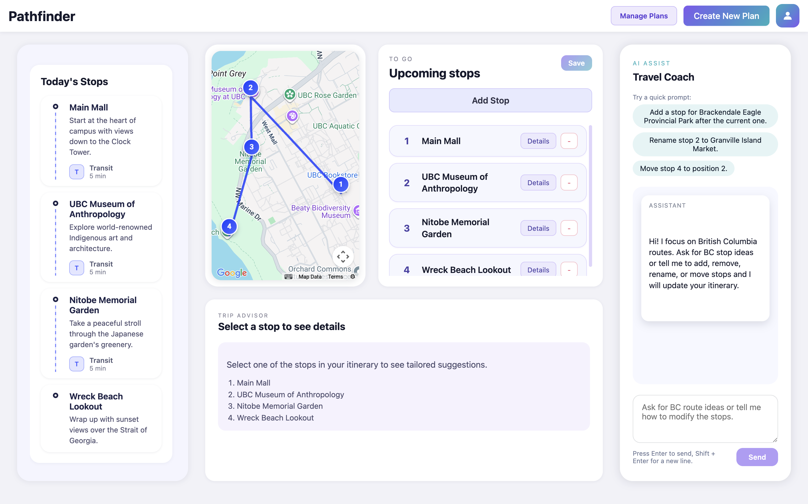
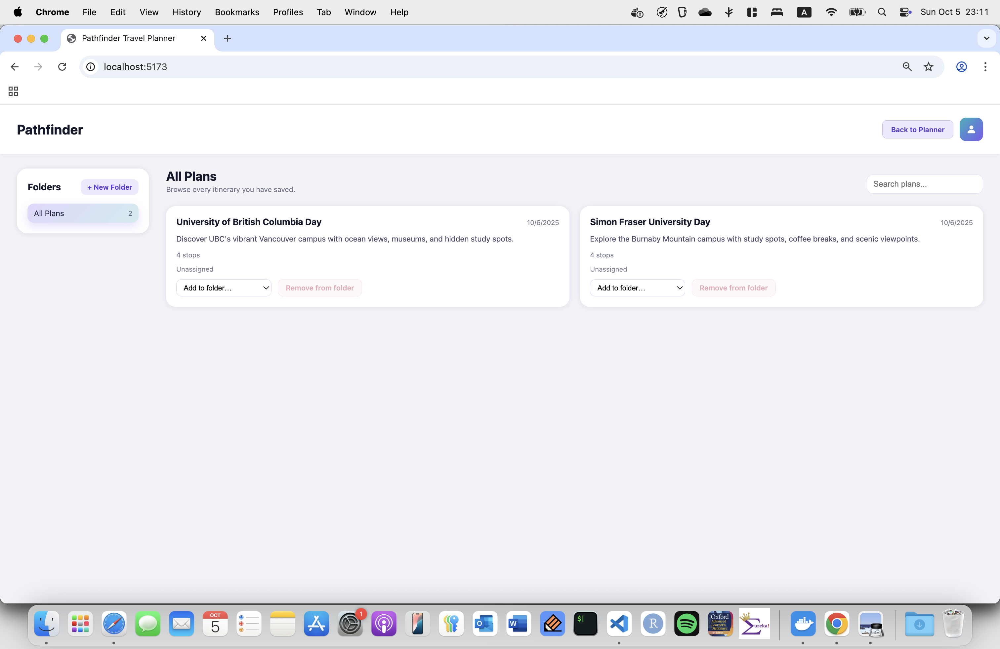

# 🗺️ Pathfinder Travel Advisor



Pathfinder is a collaborative travel planner built for **StormHacks 2025**. Describe the vibe of your day, personalize stops with an AI travel coach, and visualize the whole route in one polished interface powered by Google Maps and Gemini.

## Quick Links
- 🌐 **Live demo:** [Website](http://hoyongj.github.io/StormHacks2025) (frontend mock mode)

## Why Pathfinder?
- 🧭 **AI-guided itineraries** — Gemini suggests, adds, renames, or reorders stops on demand.
- 🌐 **Context-rich routing** — Google Maps renders every route, estimated travel time, and stop order.
- 📚 **Plan management** — Organize itineraries in folders, duplicate favorites, and revisit past days.
- 🎯 **Trip motivations** — Curate plans by mood (Food, Nature, Architecture, Nightlife, and more).
- ⚙️ **Configurable stack** — Run fully in Docker or explore locally with mock data until API keys are ready.

## Interface Tour
### Planner Home
Everything you need—map, active stops, trip advisor, and AI chat—lives on one screen.



### Start a New Adventure
Capture start/end points, travel dates, and motivations in seconds.


### Curate Stops
Use the Upcoming Stops panel to add, reorder, or remove waypoints while the Today’s Stops view highlights what’s next.


### Visualize the Journey
Google Maps powers live routing so you can see how everything connects before you head out.


### Discover Nearby Gems
The Trip Advisor module surfaces restaurants, attractions, and stay options around each stop.


### Chat with the AI Travel Coach
Talk naturally to adjust your itinerary or ask for British Columbia ideas tailored to your vibe.


### Keep Plans Organized
Browse every itinerary from a library page or jump straight to favorites via the sidebar widget.


## Architecture at a Glance
- **Frontend:** React + Vite single-page app served by Nginx, backed by Google Maps JavaScript SDK.
- **Backend:** FastAPI orchestrates Gemini and Google Maps Directions APIs for AI coaching and travel times.
- **Mock mode:** Frontend ships with seeded data so the demo works even without API keys.
- **Infrastructure:** Docker Compose spins up Nginx (frontend) and FastAPI (backend) services with a shared `.env`.

## Getting Started
### 1. Clone the Repo
```bash
git clone https://github.com/hoyongj/StormHacks2025.git
cd StormHacks2025
```

### 2. Configure Environment Variables
```bash
cp .env.example .env
```

Update the placeholders with your credentials:
```bash
GEMINI_API_KEY=your_gemini_key
GOOGLE_MAPS_API_KEY=your_google_maps_key
VITE_GOOGLE_MAPS_API_KEY=your_google_maps_key
```

> Tip: Leaving the keys blank keeps the app in **mock mode** with static demo data—perfect for showcasing without hitting external APIs.

### 3. Run with Docker
```bash
docker-compose up --build
```

Visit [http://localhost:5173](http://localhost:5173) for the frontend and [http://localhost:8000/docs](http://localhost:8000/docs) to explore the FastAPI endpoints.

### 4. Frontend Development without Docker
```bash
cd frontend
npm install
npm run dev
```

The dev server runs on [http://localhost:5173](http://localhost:5173). If you also need live API functionality, run the backend in another terminal:
```bash
cd backend
python -m venv .venv
source .venv/bin/activate
pip install -r requirements.txt
uvicorn app.main:app --reload
```

## Built for StormHacks 2025
Created by **Team Pathfinder** to streamline trip planning with conversational AI and intuitive visuals. Explore, fork, and adapt it for your next hackathon or travel hack!

## 📄 License

This project is released under the **MIT License**.
